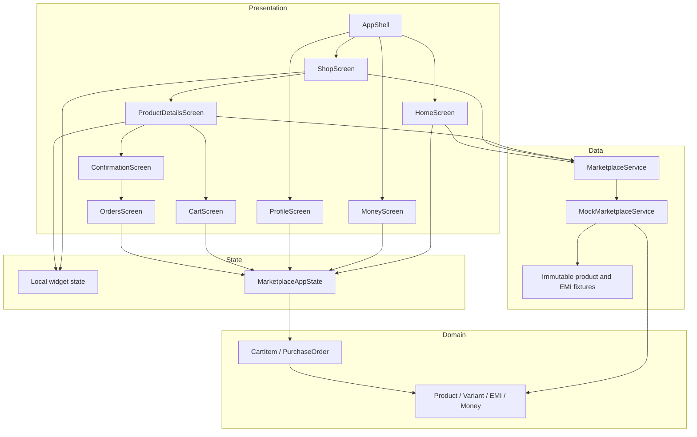
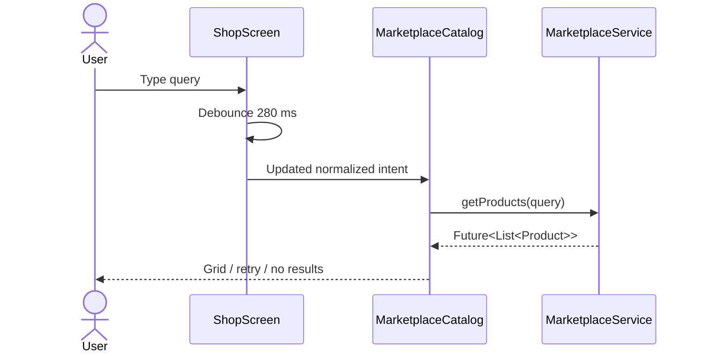
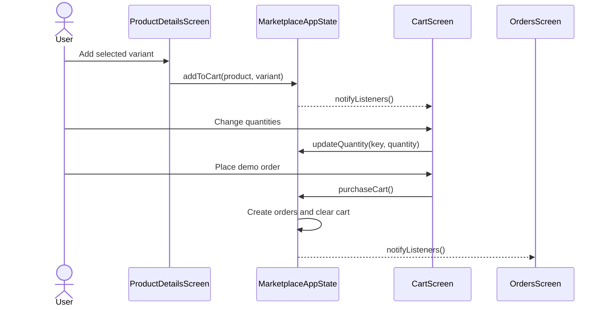

# 1Fi Marketplace — Implementation and Architecture

**Document version:** 2.0

**Runtime:** Flutter / Dart

**Architecture style:** Layered, dependency-light, mobile-first

## 1. Engineering context

The original product documents recommended creating a React Native/Expo application because no starter repository was assumed to exist. The supplied workspace, however, already contained a valid Flutter project with Android, iOS, web, and desktop hosts. The implementation therefore stays on Flutter rather than replacing a working native toolchain.

This decision preserves the required Android/iOS outcome while avoiding duplicate project setup, additional JavaScript tooling, and unnecessary runtime dependencies.

## 2. Design principles

1. **Service-backed UI** — screens never own fixture collections.
2. **One shared commerce state** — cart, orders, purchases, and EMI activity cannot drift apart.
3. **Local presentation state** — search, selected section, variant, and plan stay close to the widgets that own them.
4. **Explicit finance information** — total payable and fees are visible before confirmation.
5. **Deterministic simulation** — fixtures and failures are predictable and testable.
6. **Dependency restraint** — Flutter SDK primitives solve the current scale cleanly.
7. **Replaceable boundaries** — mock data can be replaced without redesigning screens.

## 3. Architecture



## 4. Source modules

### `lib/models.dart`

Defines the catalog/finance domain:

- `Money` — integer amount in major INR units.
- `ProductVariant` — stable ID, customer-facing label, price, and availability.
- `Product` — identity, name, category, content, pricing, variants, specifications, eligibility, and artwork metadata.
- `EmiPlan` — product/variant key, tenure, installment, total payable, rate, fee, provider, and zero-cost status.
- `formatCurrency` — centralized Indian digit grouping (`₹12,50,000`).

No view-specific properties such as selected state or loading state are placed in these records.

### `lib/marketplace_service.dart`

Defines the asynchronous data boundary:

```dart
abstract interface class MarketplaceService {
  Future<List<Product>> getProducts([String query = '']);
  Future<Product> getProduct(String productId);
  Future<List<EmiPlan>> getEmiPlans(String productId, [String? variantId]);
}
```

`MockMarketplaceService` is the current implementation. It provides:

- immutable product and plan fixtures;
- deliberate latency through `Future.delayed`;
- normalized case-insensitive search;
- ID-based product lookup;
- product- and variant-aware plan filtering;
- typed `MarketplaceException` failures;
- `failNextRequest` for deterministic error-state demonstrations.

The catalog currently contains ten products and categories. Plan fixtures are authoritative: the UI displays returned installment and total values rather than recalculating lending terms.

### `lib/app_state.dart`

Defines shared in-session commerce state with `ChangeNotifier`:

- `CartItem` derives its product/variant key, unit price, and line total.
- `PurchaseOrder` records identity, product, variant, quantity, amount, method, time, and optional EMI plan.
- `MarketplaceAppState` owns mutable cart lines and order records.

Public operations:

- `addToCart(product, variant)`
- `updateQuantity(key, quantity)`
- `purchaseCart()`
- `purchaseWithEmi(product, variant, plan)`

Derived views include cart count, cart total, reverse-chronological orders, and EMI-only orders. Callers cannot mutate the internal lists because getters return unmodifiable views.

### `lib/app_pages.dart`

Contains connected application destinations and supporting UI:

- `HomeScreen`
- `MoneyScreen`
- `ProfileScreen`
- `CartScreen`
- `OrdersScreen`
- `PurchaseSuccessScreen`
- shared cart badges, order cards, metrics, product icons, empty cards, and menu rows

These pages read the shared state. Cart and Orders also use `AnimatedBuilder` so pushed routes react immediately to quantity and order mutations.

### `lib/main.dart`

Contains application composition and the core Shop flow:

- app entry point and Material 3 theme;
- `AppShell` and state-preserving `IndexedStack` tabs;
- Shop header, selector, search, catalog, and product cards;
- product detail and variant selection;
- EMI loading, selection, and disclosures;
- purchase review and navigation;
- shared loading, error, and empty presentation.

## 5. Dependency composition

`OneFiApp` accepts optional service and state instances:

```dart
const OneFiApp({
  MarketplaceService? service,
  MarketplaceAppState? appState,
});
```

Production-style composition happens at the root. Tests inject a zero-delay mock service. The app disposes state only when it created that state, allowing callers to manage injected state lifetimes safely.

## 6. State ownership

| State | Owner | Reason |
| --- | --- | --- |
| Active bottom tab | `AppShell` | Shared navigation concern |
| Shop section | `ShopScreen` | Relevant only inside Shop |
| Search controller/query | `ShopScreen` | User-input presentation state |
| Catalog request | `MarketplaceCatalog` | Server-like state for one view |
| Product request | `ProductDetailsScreen` | Detail route concern |
| Selected variant | `ProductDetailsScreen` | Local purchase configuration |
| EMI request | `ProductDetailsScreen` | Depends on product/variant |
| Selected plan ID | `ProductDetailsScreen` | Local exclusive selection |
| Cart | `MarketplaceAppState` | Read and mutated across tabs/routes |
| Orders/purchases | `MarketplaceAppState` | Read by Home, Money, Profile, Orders |

This split avoids a global store for transient controls while preventing shared commerce data from being duplicated.

## 7. Data flows

### 7.1 Catalog search



### 7.2 Variant and EMI selection

1. Details loads a product by ID.
2. The first available variant becomes the default.
3. Plans load for the product/variant key.
4. Selecting a plan stores only its ID.
5. Changing variant clears the plan ID and creates a new plan request.
6. The selected plan is derived from current response data.
7. Continue remains disabled when derivation fails or no plan is selected.

Storing only the selected ID avoids duplicating a full plan object that could become stale after a variant request.

### 7.3 Cart purchase



### 7.4 EMI purchase

1. User selects a plan and continues.
2. Confirmation displays the complete plan summary.
3. Confirm Purchase calls `purchaseWithEmi`.
4. The state creates one order with the selected plan attached.
5. Purchase Success shows the generated order reference.
6. Money derives active plans and monthly commitments from EMI orders.

## 8. Navigation design

The root uses `IndexedStack` to preserve tab state:

```text
AppShell
├── Home
├── Money
├── Shop
└── Profile
```

Secondary experiences are stack routes:

```text
Shop → Product Details → Purchase Review → Purchase Success → Orders
Home/Profile/Shop → Cart → Purchase Success → Orders
Home/Profile → Orders
```

This is intentionally implemented with Flutter's native `Navigator`; the route graph does not yet require a declarative routing dependency or deep-link parser.

## 9. Responsive layout

- Screen roots use `SafeArea` where system insets matter.
- Long screens use `ListView` or `CustomScrollView`.
- Product detail content scrolls independently above the persistent purchase bar.
- Catalog layout switches at 540 logical pixels.
- Narrow layouts render one horizontal product card per row.
- Wider layouts render a two-column grid.
- Money, cart, and profile content use flexible rows with expanded children.
- Essential plan figures are never intentionally truncated.

## 10. Accessibility implementation

- `Semantics` labels identify product illustrations and product cards.
- Section controls and EMI cards expose `selected` state.
- Native buttons expose disabled state automatically.
- Selected EMI plans combine a check icon, thicker border, tinted surface, and semantic selection.
- Tooltips label cart, clear-search, quantity, remove, and other icon actions.
- Color contrast uses dark ink on white/tinted surfaces and white on the purple gradient.
- Navigation and purchase controls meet practical mobile touch sizing.

## 11. Visual system

| Token | Value | Usage |
| --- | --- | --- |
| Primary | `#6438D7` | Navigation, selected controls, amounts, actions |
| Background | `#F7F6FA` | Application canvas |
| Ink | `#19151F` | Primary text |
| Muted | `#716B78` | Supporting metadata |
| Success | `#137248` / soft green | Confirmed orders and zero-cost plans |
| Surfaces | White | Cards, fields, bottom bars |

Cards use generous radii, restrained borders/shadows, and category accent colors. Product artwork is rendered with Material icons to remain deterministic, lightweight, and license-safe across platforms.

## 12. Error handling

`MarketplaceException` represents recoverable service failures. Async widgets distinguish:

- waiting — progress indicator;
- error — friendly copy and Retry;
- empty — contextual explanation and recovery action;
- data — normal experience.

Failures are never random by default. `failNextRequest` fails exactly one subsequent request, then automatically resets.

## 13. Testing strategy

The automated suite uses zero-delay service injection and covers:

- Indian currency grouping;
- name and category search across the ten-product catalog;
- variant-specific EMI filtering;
- cart line aggregation, checkout, order creation, and cart clearing;
- EMI orders appearing in finance activity;
- functional Home, Money, and Profile navigation;
- Marketplace section and product rendering;
- disabled EMI action before selection and enabled action afterward.

See [TESTING.md](TESTING.md) for commands, manual scenarios, and the acceptance matrix.

## 14. Build and platform notes

- Android native debug APK builds successfully in the current workspace.
- Web release output builds successfully and is used for rapid visual review.
- iOS project files are present but require macOS/Xcode for compilation and signing.
- Desktop host folders are generated but are not primary product targets.

## 15. Extension points

### Replace mock APIs

Implement `MarketplaceService`, then inject it into `OneFiApp`. UI consumers require no fixture knowledge.

### Persist commerce state

Replace or wrap `MarketplaceAppState` operations with authenticated cart/order repositories. The UI-facing derived properties can remain stable.

### Add real product images

Extend `Product` image metadata and replace icon artwork with a cached network-image component containing loading and failure fallbacks.

### Add production routing

Introduce named/declarative routes when deep links, authentication redirects, web URLs, and state restoration become requirements.

### Add real finance workflows

Use backend-authoritative eligibility, signed terms, idempotent confirmation, audit records, consent, and compliance-reviewed disclosures. Client-calculated eligibility must not replace server decisions.

## 16. Known engineering limitations

- Shared state is in memory and intentionally small.
- Order IDs are deterministic in-session sequences, not globally unique server IDs.
- Order status is always Confirmed because no fulfillment service exists.
- EMI plans are displayed as returned fixtures; repayment schedules are not generated.
- Home recommendation ordering is fixture ordering, not personalization.
- No local database, secure storage, API client, telemetry, or background task exists.
- No integration test currently drives a native emulator end to end.

These are explicit assignment boundaries rather than hidden production claims.

## 17. Delivery checklist

- [x] Four functional primary destinations
- [x] Ten-product asynchronous catalog
- [x] Search and no-results recovery
- [x] Product variants and specifications
- [x] Variant-aware EMI plans
- [x] Shared cart and quantity controls
- [x] Demo full-payment and EMI purchases
- [x] Orders and recent-purchase history
- [x] Responsive and accessible UI
- [x] Static analysis clean
- [x] Eight automated tests passing
- [x] Android APK build verified
- [x] Web release build verified
- [x] Detailed repository documentation
