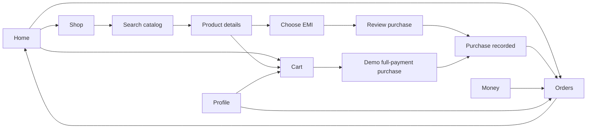

# 1Fi Marketplace

> A polished, end-to-end Flutter finance-shopping application for discovering products, comparing transparent EMI plans, managing a cart, recording demo purchases, and reviewing financial activity.

[](https://flutter.dev/)
[](https://dart.dev/)
[](#platform-support)
[](TESTING.md)

## Overview

1Fi Marketplace is a complete mobile-first product demonstration built from scratch because no 1Fi source repository, backend, or production design system was supplied. It expands the original Shop assignment into a connected four-tab application:

- **Home** summarizes purchasing power, quick actions, popular products, and recent purchases.
- **Money** shows available spending limit, active EMI plans, and monthly commitments.
- **Shop** provides catalog discovery, search, product details, variants, cart actions, and EMI selection.
- **Profile** centralizes account activity, cart access, orders, support placeholders, and app information.

The catalog and EMI records are served through a typed asynchronous service boundary. Cart, purchases, orders, and EMI activity share one dependency-free application state, so an action taken in Shop is immediately reflected throughout the rest of the app.

> **Important:** checkout, orders, spending limits, and EMI activity are simulated locally. No real payment, credit decision, loan, inventory reservation, or fulfillment occurs.

## Product highlights

### Connected application shell

- Functional Home, Money, Shop, and Profile destinations
- State-preserving bottom navigation
- Standard back behavior for product, cart, order, confirmation, and success routes
- Cart count badges visible from Home and Shop
- Mobile safe-area handling and persistent bottom actions

### Marketplace

- Ten-product catalog covering personal electronics and home appliances
- Asynchronous loading through `MarketplaceService`
- Debounced client-side search by product name and category
- Responsive one- or two-column catalog layout
- Loading, retryable error, no-results, and deliberate-empty states
- Category-specific, license-safe Material illustrations

### Product and EMI experience

- Detailed product descriptions and specifications
- Optional original pricing and discount presentation
- Variant selection with variant-specific price and availability
- Dynamically loaded EMI plans keyed by product and variant
- Exclusive single-plan selection
- Clear tenure, monthly installment, total payable, interest, zero-cost status, and processing-fee disclosures
- Disabled EMI action until a valid plan is selected
- Plan selection resets safely whenever the variant changes

### Cart, checkout, and purchases

- Shared cart accessible across the app
- Variant-aware cart lines
- Increment, decrement, and remove controls
- Live line totals, subtotal, and free-delivery summary
- Demo full-payment checkout
- Demo EMI purchase confirmation
- Generated local order references
- Unified order history for full-payment and EMI purchases
- Purchase success and recent-purchase states

### Accessibility and quality

- Semantic labels for product imagery and financial controls
- Selected and disabled states exposed to assistive technology
- Selection communicated with icon, border, text, and color
- Touch targets designed for mobile use
- Scroll-safe narrow-phone layouts
- Indian currency formatting centralized in one utility
- No third-party runtime state-management package

## Catalog

| Product | Category | Starting price | Variants | EMI |
| --- | --- | ---: | --- | --- |
| Nova Pro 5G | Smartphones | ₹54,999 | 128 GB / 256 GB | 3–12 months |
| Feather Air 14 | Laptops | ₹74,990 | 8 GB / 16 GB | 6–12 months |
| QuietBeat Studio | Audio | ₹12,999 | Black / Sand | 3–6 months |
| Pulse Watch S | Wearables | ₹8,999 | Standard | 3 months |
| VisionView QLED TV | Televisions | ₹49,990 | 55 inch / 65 inch | 6–12 months |
| EcoWash Front Load | Washing Machines | ₹32,990 | 8 kg / 10 kg | 6–9 months |
| FrostFresh Refrigerator | Refrigerators | ₹38,990 | 340 L / 420 L | 6–12 months |
| BreezeMax Inverter AC | Air Conditioners | ₹36,990 | 3-star / 5-star | 6–12 months |
| QuickChef Microwave | Kitchen Appliances | ₹12,990 | Standard | 3 months |
| CleanBot Smart Vacuum | Home Care | ₹24,990 | White / Black | 6 months |

All prices and plan terms are deterministic mock data expressed in major INR units.

## Experience map



## Technology

| Area | Choice | Why |
| --- | --- | --- |
| UI | Flutter Material 3 | Native mobile behavior with one cross-platform implementation |
| Language | Dart | Strongly typed models and null safety |
| State | `ChangeNotifier` + local widget state | Sufficient for this focused app without additional dependencies |
| Data | Typed in-memory fixtures | Deterministic, testable replacement for unavailable APIs |
| Async layer | `Future`-based service interface | Exercises realistic loading, error, and retry states |
| Navigation | Flutter `Navigator` + `MaterialPageRoute` | Standard stack behavior without an extra routing package |
| Tests | `flutter_test` | Unit and widget coverage using the bundled Flutter toolchain |

## Repository structure

```text
lib/
├── app_pages.dart            # Home, Money, Profile, Cart, Orders, success UI
├── app_state.dart            # Shared cart, purchase, order, and EMI state
├── main.dart                 # App theme, shell, Shop, product, EMI, confirmation
├── marketplace_service.dart  # Service contract, fixtures, latency, typed errors
└── models.dart               # Money, product, variant, EMI models and formatting

test/
└── marketplace_test.dart     # Unit and widget regression suite

android/                      # Android host project
ios/                          # iOS host project
web/                          # Web host project
linux/ macos/ windows/        # Generated desktop host projects

README.md                     # Project entry point
SRS.md                        # Complete software requirements specification
IMPLEMENTATION.md             # Architecture and engineering decisions
USER_GUIDE.md                 # Product walkthrough
TESTING.md                    # Automated and manual verification guide
```

## Getting started

### Prerequisites

- Flutter SDK 3.35 or newer
- Dart SDK compatible with `^3.13.2`
- One target environment:
  - Android Studio/Android SDK and an emulator or device
  - macOS with Xcode for iOS
  - Chrome for web preview
- Git for source control

Confirm the local setup:

```bash
flutter doctor
flutter devices
```

### Install

```bash
git clone https://github.com/Brahma-Agni/1fi-assessment.git
cd 1fi-assessment
flutter pub get
```

### Run

Let Flutter ask for a target:

```bash
flutter run
```

Or select one directly:

```bash
# Android device or emulator
flutter run -d android

# Chrome
flutter run -d chrome

# iOS simulator on macOS
flutter run -d ios
```

Use `r` for hot reload and `R` for hot restart while the development process is running.

## Build

```bash
# Android debug APK
flutter build apk --debug

# Android release bundle for Play distribution
flutter build appbundle --release

# Web release bundle
flutter build web

# iOS release build on macOS
flutter build ios --release
```

Common build outputs:

- APK: `build/app/outputs/flutter-apk/app-debug.apk`
- Android App Bundle: `build/app/outputs/bundle/release/app-release.aab`
- Web: `build/web/`

Release signing, App Store provisioning, store metadata, and production identifiers must be configured before publishing.

## Verify

Run the complete local quality gate:

```bash
dart format --output=none --set-exit-if-changed lib test
flutter analyze
flutter test
flutter build web
```

The current suite contains eight passing tests covering currency formatting, catalog search, variant-specific EMI plans, cart-to-order conversion, EMI activity, bottom navigation, Shop rendering, and EMI CTA behavior. See [TESTING.md](TESTING.md) for the full verification matrix.

## Demonstrating async states

`MockMarketplaceService` exposes a deterministic one-shot failure switch:

```dart
final service = MockMarketplaceService();
service.failNextRequest = true;
```

The next service request throws a typed `MarketplaceException`, after which normal behavior resumes. This makes catalog, product, and EMI retry states demonstrable without random failures.

## Data and state lifecycle

- Product and EMI fixtures live only in `marketplace_service.dart`.
- UI widgets receive typed records; they do not import raw fixture collections.
- Catalog and plan calls include deliberate latency to expose loading states.
- Shop selection, search query, selected variant, and selected plan are local UI state.
- Cart and order activity live in `MarketplaceAppState` and notify every active tab.
- Cart checkout creates one order per cart line and clears the cart.
- EMI confirmation creates an order carrying the selected `EmiPlan`.
- State is intentionally in memory and resets when the app restarts.

## Platform support

| Platform | Project included | Verified in this workspace | Notes |
| --- | --- | --- | --- |
| Android | Yes | Native debug APK built successfully | Primary mobile verification target |
| iOS | Yes | Source/project present | Requires macOS and Xcode to compile |
| Web | Yes | Release build and phone-sized preview verified | Useful for review and demonstration |
| Desktop | Generated hosts included | Not a product target | Incidental Flutter support |

## Known limitations

- No authentication or real user profile
- No persistent database; cart and orders reset on restart
- No production product, eligibility, inventory, or pricing API
- No payment gateway, credit bureau, underwriting, or loan origination
- No actual delivery, fulfillment, cancellation, refund, or order tracking backend
- Top Brands and Nearby Stores remain intentionally empty per the original scope
- Support and notification entries are integration-ready placeholders
- Product artwork is neutral iconography rather than merchant imagery

## Production integration path

The UI is deliberately separated from data access and shared commerce state. A production implementation would:

1. Replace `MockMarketplaceService` with an HTTP implementation of `MarketplaceService`.
2. Move authentication and customer identity behind secure platform storage.
3. Persist cart and orders through backend endpoints.
4. Fetch eligibility and plan terms from an authoritative lending service.
5. Add payment/loan confirmation with idempotency, server validation, and audit records.
6. Add remote images with caching, fallbacks, and licensed assets.
7. Add analytics, observability, crash reporting, and feature flags.
8. Configure production application IDs, signing, privacy disclosures, and store release pipelines.

## Documentation

- [Software Requirements Specification](SRS.md)
- [Implementation and Architecture](IMPLEMENTATION.md)
- [User Guide](USER_GUIDE.md)
- [Testing and Verification](TESTING.md)

## License and attribution

This repository is an assessment/demo implementation. “1Fi” is used only to identify the requested product concept. Neutral generated names, mock data, and Material icons are used to avoid implying official merchant inventory or asset ownership.
